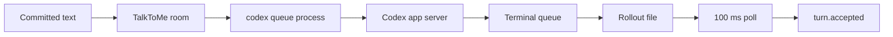
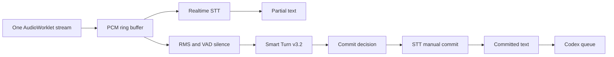

# Parallel input and Codex delivery

Research date: September 26, 2026.

This note does not change an input or delivery path.

## Scope

The goal is lower delay in two parts of the call.

The first part is speech recognition and turn detection.

The second part is delivery to an existing Codex terminal session.

TalkToMe must send only committed user text to Codex.

A partial transcript can change before its commit.

[Input streaming](INPUT_STREAMING.md) records that TalkToMe cannot replace a message after it sends that message.

## Measured and observed facts

| Fact | Type | Evidence |
| --- | --- | --- |
| The installed command is `codex-cli 0.157.0`. | Local observation | `codex --version` on September 26, 2026. |
| `codex queue` needs `--thread` and `--message`. | Local observation | `codex queue --help` on September 26, 2026. |
| `attach.py` starts one `codex queue` process for each committed message. | Local source fact | [attach.py](../../../src/talktome/attach.py) calls `subprocess.run` with `queue_argv`. |
| The queue command timeout is 120 seconds. | Local source fact | [attach.py](../../../src/talktome/attach.py) sets `timeout=120`. |
| The rollout reader checks for new data each 100 ms. | Local source fact | [attach.py](../../../src/talktome/attach.py) sets `POLL = 0.1`. |
| `turn.accepted` follows a matching `UserMessage` record. | Local source fact | [attach.py](../../../src/talktome/attach.py) compares the recorded text with the committed text. |
| An earlier local queue measurement was 0.09 to 0.31 s. | Local measurement | [Codex TUI delivery](CODEX_TUI_DELIVERY.md) records this result. |
| The earlier measurement does not include terminal paint time. | Local measurement limit | [Codex TUI delivery](CODEX_TUI_DELIVERY.md) states this limit. |
| `RealtimeInput` groups microphone frames into 0.16 s PCM chunks. | Local source fact | [realtime-input.js](../../../src/talktome/static/realtime-input.js) sets `CHUNK_SECONDS = 0.16`. |
| The present provider path uses manual transcript commits. | Local source fact | [realtime-input.js](../../../src/talktome/static/realtime-input.js) sends `commit_strategy=manual`. |
| Smart Turn v3.2 accepts 16 kHz mono PCM. It accepts at most eight seconds. | Primary source fact | [Smart Turn README](https://github.com/pipecat-ai/smart-turn/blob/main/README.md). |

The polling loop can add 0 to 100 ms after the rollout write.

Its mean extra delay is about 50 ms only if writes have a uniform phase.

That mean is an inference. No local call measured it.

## Current delivery path



`queue_argv` creates this command:

```text
codex queue --thread THREAD_ID --message TEXT
```

The local `codex queue` help describes this command as a message queue operation.

The queue protocol uses `thread/queue/add`.

The protocol marks this method as experimental.

[Codex protocol source](https://github.com/openai/codex/blob/main/codex-rs/app-server-protocol/src/protocol/common.rs) lists the method.

The queue command source sends this method with a client message identifier.

It expects `queued_submission.id` in the response.

[Codex queue source](https://github.com/openai/codex/blob/main/codex-rs/tui/src/session_queue_commands.rs) shows this request.

The method returns a queued submission.

[Queue type source](https://github.com/openai/codex/blob/main/codex-rs/app-server-protocol/src/protocol/v2/thread.rs) defines that response.

The queue success result means that Codex stored the submission.

It does not mean that the terminal read or painted the text.

The rollout record proves that the stored text entered a Codex turn.

It does not measure terminal redraw.

## Delivery alternatives

| Method | Can lower delay | Limits | Status |
| --- | --- | --- | --- |
| Keep `codex queue` | No new work | It starts one process for each message. | Current path |
| Keep one app-server client | It removes the per-message command start. | The queue method is experimental. The client must handle protocol and connection changes. | Viable experiment |
| Use `codex app-server proxy` | It connects stdio to the running app-server control socket. | The local help does not promise a stable public client contract. | Viable experiment |
| Use `codex queue --remote` | It can use a named app-server endpoint. | Network setup does not remove queue dispatch. | Viable only when that server already exists |
| Start or resume a second session | It can give TalkToMe a writer it owns. | It does not control the terminal-owned thread. | Different product behavior |
| Send partial transcripts | It can move a first queue request earlier. | Later transcript text can change. TalkToMe cannot replace a queued message. | Do not use |

The installed help lists `codex app-server proxy`.

It says that proxy sends stdio bytes to the running control socket.

The help also lists `stdio`, Unix socket, and WebSocket transports for app-server.

These are native Codex channels.

The local help labels app-server experimental.

No local measurement in this research shows a delay gain from a persistent client.

The likely gain is the command start cost.

That statement is an inference.

The current 0.09 to 0.31 s result sets an upper bound for that gain in the measured case.

The direct client cannot bypass a busy terminal turn.

The public protocol gives queue add, list, update, delete, reorder, and start methods.

All queue methods are experimental in the current source.

Do not use queue update or delete for partial speech without a real call test.

Their effect on a terminal-owned active turn is not measured here.

`thread/inject_items` adds history items without starting a user turn.

It is not a replacement for a queued user request.

[Codex protocol source](https://github.com/openai/codex/blob/main/codex-rs/app-server-protocol/src/protocol/common.rs) shows this method.

The official App Server guide documents `thread/start`, `thread/resume`, `turn/start`, `turn/steer`, and `turn/interrupt`.

It does not document `thread/queue/add`.

A managed TalkToMe session can use its own writer and those documented turn methods.

An attached terminal session cannot use this path without changing its ownership behavior.

[Codex App Server guide](https://developers.openai.com/codex/app-server) documents the turn methods.

## One writer and queue validation

The attached adapter states that an existing terminal owns the thread writer.

TalkToMe therefore queues a message and reads the append-only rollout.

It cannot stop the terminal turn.

[attach.py](../../../src/talktome/attach.py) records this rule and behavior.

The current queue validation has two stages.

1. `subprocess.run` returns a zero exit status.
2. The rollout later contains the exact committed user text.

The first stage checks command acceptance.

The second stage checks turn acceptance.

Neither stage checks terminal paint.

The app uses the second stage to set `accepted_ms`.

The rollout polling interval can delay that mark by one polling period.

A terminal screen diff can estimate paint time.

It cannot prove that Codex accepted the input before that paint.

Do not replace the rollout check with a redraw check.

Use both marks if terminal display delay matters.

## Parallel recognition and turn detection



Keep one microphone capture path.

The present worklet already supplies PCM to `RealtimeInput`.

The real-time recognizer can send partial text while the user speaks.

Keep partial text in the call display only.

Run Smart Turn after the RMS or VAD rule finds a silence candidate.

Give Smart Turn the whole current user turn.

Resample a copy of that PCM to 16 kHz mono for Smart Turn.

Keep the provider PCM format for real-time STT.

If speech resumes, cancel the old Smart Turn result.

Then run Smart Turn again on the complete current turn.

Commit the real-time recognizer only after the final turn decision.

This keeps partial transcript changes out of Codex.

Smart Turn is audio-native. It does not use an STT partial transcript.

The model source says it should run after silence detection.

It does not replace a VAD or a maximum wait.

[Smart Turn README](https://github.com/pipecat-ai/smart-turn/blob/main/README.md) gives these rules.

## Local Smart Turn v3.2

Smart Turn v3.2 is a viable local candidate after validation.

The project license is BSD-2-Clause.

The CPU model is an 8 MB quantized model.

The project reports CPU inference as low as 10 ms on some CPUs.

These are project claims. They are not measurements on this Mac.

[Smart Turn README](https://github.com/pipecat-ai/smart-turn/blob/main/README.md) gives the model facts.

The current project can store an eight-second PCM window.

It must resample to 16 kHz for this model.

The current Pipecat source uses ONNX Runtime and the `smart-turn-v3.2-cpu.onnx` file.

[Pipecat Smart Turn source](https://github.com/pipecat-ai/pipecat/blob/main/src/pipecat/audio/turn/smart_turn/local_smart_turn_v3.py) shows this implementation.

The current real-time input supports 16, 44.1, and 48 kHz audio.

The input code sends frames every 0.16 s.

Thus, a local side worker can run Smart Turn without a second microphone request.

This design is inferred from the present code and the model input rules.

It needs a local timing measurement before release.

## Earlier blocker

Do not connect Smart Turn to the live turn decision now.

The earlier synthetic speech test did not separate complete speech from incomplete speech.

[Voice turn taking](VOICE_TURN_TAKING.md) records this result.

The finished synthetic sentence scored 0.57.

The unfinished synthetic phrase scored 0.72.

The reference feature extractor produced 0.566 and 0.721 for the same clips.

[Work log](../WORK_LOG.md) records these measurements and the prosody limit.

Record real user speech before a live control change.

Include quiet rooms, fan noise, short answers, long thought pauses, and fading speech.

Label each recording as complete or incomplete at each silence candidate.

Measure false cutoff rate, late commit rate, and end-of-speech to first-audio time.

Compare the current RMS rule with Smart Turn on the same recordings.

Keep the current maximum wait as a fallback during this test.

Do not send an unvalidated semantic result to Codex.

## Next measurements

1. Record speech end, provider commit, committed text, queue start, queue return, rollout acceptance, and first audible reply.
2. Record terminal paint separately with a terminal screen-diff observer.
3. Compare the process queue path with one persistent app-server client on the same loaded terminal thread.
4. Record queue return and rollout acceptance for each path.
5. Test Smart Turn on recorded real speech before a live call integration.
6. Compare Smart Turn time and error rate with the present RMS rule.

## Notch Glow repository

I read the README of the separate Notch Glow repository.

It is reusable unchanged.

This research did not edit that repository.

## Implementation update: September 27, 2026

The attached Codex adapter now keeps one queue proxy for each call.
The request matches the schema from the installed Codex command.
Initialization failure uses the existing CLI before a user message exists.
Only an explicit unsupported-method response permits fallback after a queue request.
An uncertain delivery does not trigger a resend.
No real call measured the change yet.

Smart Turn remains outside live turn control in this checkpoint.
It needs no new training dataset. Pipecat supplies recorded test speech for initial checks.
The model and dataset links are on the [model page](https://huggingface.co/pipecat-ai/smart-turn-v3).
A later integration can use these recordings before normal call checks.

## Smart Turn integration update

[Smart Turn](../../SMART_TURN.md) now describes the implemented path.
The pinned v3.2 graph ends with Sigmoid, despite its `logits` output name.
The app uses the output probability directly. The earlier output-type inference was incorrect.
No live call or model accuracy check ran during integration.
